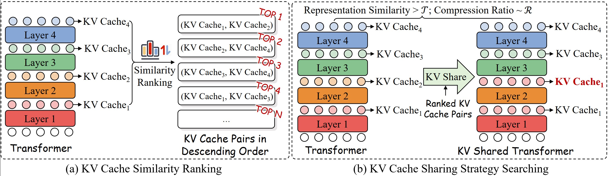

# KVSharer: Efficient Inference via Layer-Wise Dissimilar KV Cache Sharing

  

## Recommended software environment
- python == 3.10
- torch == 2.1.2
- transformers >= 4.38.0
- scikit-learn >= 1.0
- tqdm >= 4.49.0
- numpy >= 1.20.2

## Description

- The process of KVSharer is described in two runnable .ipynb files `test_llama.ipynb` and `test_internlm.ipynb`, detailing how to conduct strategy search and how to integrate KVSharer for inference.
- The main implementation of sharing during inference can be found in the `llama_real_share/cache_utils.py`, `internlm2_real_share/cache_utils.py` where we introduce a new class called DynamicDictCache to store only a portion of the layers' KV cache.
- We add the `kv_cache_share_layers_map` parameter in the `LlamaForCausalLM` and `InternLM2ForCausalLM` to set the sharing strategy. The implementation can be found in `llama_real_share/modeling_llama_kvsharer.py`, `internlm2_real_share/modeling_internlm2_kvsharer.py`.
- We provide a `wiki_demo.txt` file in `./data` folder for test.

> [!NOTE]  
> This repo is under construction.

